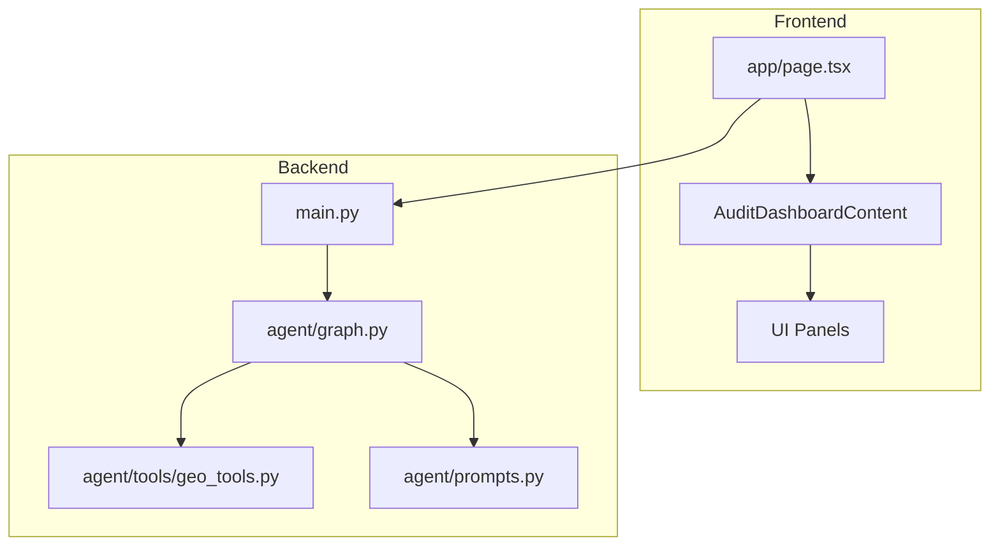
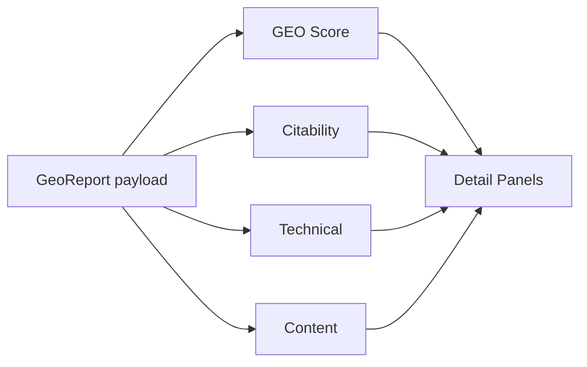

# GEO Audit Agent

> AI-powered GEO (Generative Engine Optimization) audit platform with chat + dashboard experience.

## What this project does

GEO Audit Agent analyzes public websites for AI-search readiness and returns:

- GEO score and weighted breakdown
- AI crawler accessibility matrix
- llms.txt and schema markup checks
- technical + content + brand/citability insights
- prioritized action plan with quick wins

---

## Product view

```mermaid
flowchart LR
  U[User] --> FE[Next.js Frontend]
  FE --> CHAT[Copilot Chat]
  FE --> DASH[Audit Dashboard]
  CHAT --> API[/api/copilotkit proxy]
  API --> BE[FastAPI + LangGraph]
  BE --> TOOL[compile_geo_report]
  TOOL --> WEB[Target Website]
  BE --> FE
```

## Architecture snapshot



## KPI clustering logic (dashboard)



---

## Tech stack

- **Frontend:** Next.js 15, React 18, TypeScript, Tailwind CSS, Framer Motion, Three.js
- **Backend:** FastAPI, LangGraph, LangChain
- **AI Integration:** CopilotKit runtime + co-agent shared state

---

## Local setup

### 1) Backend

```powershell
cd backend
python -m venv .venv
.venv\Scripts\activate
pip install -r requirements.txt
copy .env.example .env
python main.py
```

### 2) Frontend

```powershell
cd frontend
npm install
copy .env.example .env.local
npm run dev
```

Frontend: `http://localhost:3000`  
Backend health: `http://127.0.0.1:8000/health`

---

## Environment variables

### Frontend (`frontend/.env.local`)

- `BACKEND_URL`
- `BACKEND_AGUI_URL`
- `NEXT_PUBLIC_GITHUB_URL`
- `NEXT_PUBLIC_LINKEDIN_URL`
- `NEXT_PUBLIC_DISCORD_URL`
- `NEXT_PUBLIC_FEEDBACK_FORM_URL`

### Backend (`backend/.env`)

- `LLM_PROVIDER`
- `OPENROUTER_API_KEY` (or provider-specific key)
- provider-specific model/base URL values

> Never commit real keys. Use `.env` locally and platform secret storage in production.

---

## Documentation

- `frontend/README.md` – frontend-focused developer guide
- `docs/technical-architecture-en.md` – implementation architecture
- `docs/solution-architecture-en.md` – solution-level architecture
- `docs/agent-architecture.md` – current agent architecture (added)
- `docs/prompts-guide.md` – prompt catalog and behavior (added)

---

## Security note

Repository scan checks are part of maintenance workflow:

- no tracked `.env` files with live secrets
- key pattern scans on source/docs
- explicit placeholders only in examples/docs

