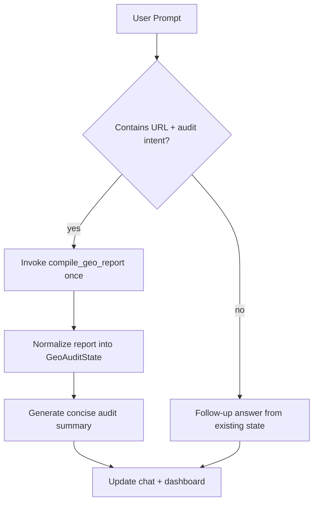

# Agent Architecture (Current State)

## Overview

The application uses a **single operational agent** named `default`, exposed through CopilotKit and backed by a LangGraph workflow.

## Runtime components

- `backend/main.py`
  - FastAPI app
  - CopilotKit endpoint mounting
  - AGUI endpoint mounting
- `backend/agent/graph.py`
  - LangGraph state machine
  - Tool routing and guardrails
  - Summary generation after tool completion
- `backend/agent/prompts.py`
  - System prompt template and language adaptation
- `backend/agent/tools/geo_tools.py`
  - Deterministic GEO audit engine (`compile_geo_report`)

## Agent flow

## Safety and control model

- Public HTTP(S) URL validation only
- Guardrail checks for sensitive/exploit/prompt-injection requests
- Tool-call enforcement:
  - allowed tool: `compile_geo_report`
  - one-call policy for audit execution path
- Follow-up mode avoids unnecessary re-audits when report already exists

## State contract

Shared state type: `GeoAuditState` (`frontend/lib/types.ts`)

Primary fields used by dashboard:
- `geo_score`
- `score_breakdown`
- `crawler_matrix`
- `citability_score` (inside `report`)
- `technical_audit.score` (inside `report`)
- `content_quality.score` (inside `report`)
- `recommendations`
- `report` (full payload)

## Frontend integration

- `useCoAgent<GeoAuditState>` binds chat and dashboard to same agent state
- `CopilotChat` handles conversational input
- Dashboard panels read from the normalized report state

