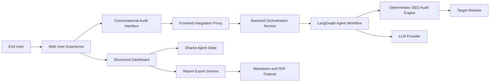
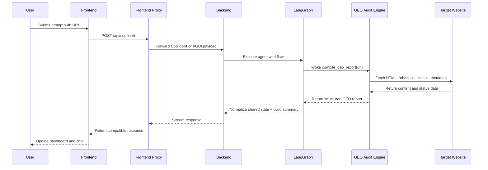
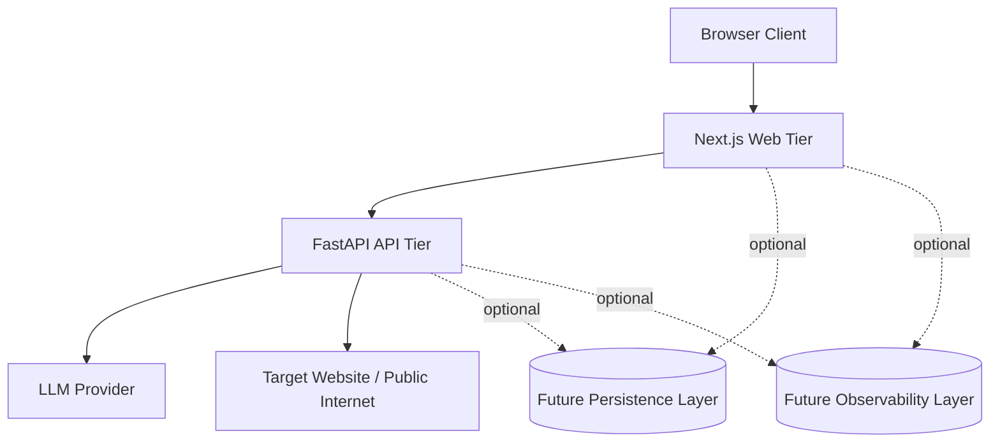

# GEO Audit Agent: Solution Architecture Document

## 1. Document Purpose

This document describes the solution architecture of the GEO Audit Agent application from a system-level perspective. It is intended to explain how the overall solution is composed, which business and technical capabilities it delivers, how the main building blocks collaborate, and how the application can evolve toward a more production-ready platform.

Where the functional analysis explains what the application does and the technical architecture explains how the codebase is structured, this document focuses on the solution as a whole:

- business-facing capabilities,
- architectural building blocks,
- runtime interactions,
- deployment view,
- operational and non-functional considerations,
- future evolution paths.

## 2. Executive Summary

GEO Audit Agent is an AI-assisted audit solution for evaluating website readiness for AI answer engines and AI-driven discovery systems. The solution combines:

- a conversational user interface,
- a structured analytical dashboard,
- an agent orchestration layer,
- deterministic GEO inspection services,
- exportable reporting outputs.

The core architectural principle is that the language model does not compute the GEO audit itself. Instead, the model acts as a conversational router and summarization layer, while the GEO assessment is performed by deterministic backend logic. This makes the solution more reliable, auditable, and maintainable than a purely prompt-driven implementation.

## 3. Business Context

The solution addresses an emerging problem: websites are increasingly evaluated not only by traditional search engines, but also by AI retrieval systems, answer engines, and generative assistants. These systems depend on signals that are adjacent to, but not identical with, classical SEO.

The solution therefore helps teams answer strategic questions such as:

- Is the site accessible and interpretable by AI crawlers?
- Are entity and authority signals sufficiently visible?
- Does the site expose machine-friendly structured information?
- Is content shaped in a way that can be cited or reused in AI answers?
- What are the most valuable actions to improve AI discoverability?

The target users may include:

- digital marketing teams,
- SEO/GEO consultants,
- product teams,
- technical SEO specialists,
- agencies producing structured audit deliverables.

## 4. Solution Goals

The solution is designed to satisfy five main goals.

### 4.1 Conversational Accessibility

Users should be able to start an audit with natural language instead of learning a technical control panel.

### 4.2 Deterministic Audit Quality

The actual GEO evaluation should not depend on prompt variability or model creativity. The findings need to come from repeatable logic.

### 4.3 Structured Insight Delivery

Audit results should be visible both as:

- a concise assistant summary,
- a detailed dashboard with specialized panels.

### 4.4 Practical Actionability

The system should not stop at diagnostics. It should return a prioritized action plan with impact and effort guidance.

### 4.5 Reusable Reporting

The solution should support report export so that results can be shared, archived, or used in consulting workflows.

## 5. Solution Scope

The current solution scope includes:

- single-URL audit initiation,
- root-level resource inspection such as `robots.txt` and `llms.txt`,
- schema, metadata, technical, content, citability, authority, and platform-readiness evaluation,
- shared state synchronization between chat and dashboard,
- report export in markdown and PDF.

The current solution does not yet include:

- persistent audit history,
- batch or portfolio-wide analysis,
- multi-user account management,
- authenticated workspaces,
- production telemetry and advanced observability,
- continuous scheduled monitoring.

## 6. Architectural Drivers

The following drivers shape the current design.

### 6.1 Predictability Over Agent Autonomy

The solution prioritizes stable and reproducible results over open-ended multi-tool agent behavior.

### 6.2 Low Friction User Experience

The user journey begins in chat, but the result must immediately appear in a structured dashboard without extra steps.

### 6.3 Provider Flexibility

The solution needs to support multiple LLM vendors, which is why the backend includes provider abstraction and compatibility safeguards.

### 6.4 Clear Presentation of Findings

The solution must surface both summary and detail. This explains the dual-surface design: conversational UI plus report panels.

### 6.5 Extensibility

The architecture must leave space for future GEO dimensions, additional exports, broader crawl scope, and richer productization.

## 7. Solution View: High-Level Capabilities

The solution can be understood as five capabilities.

### 7.1 Audit Initiation Capability

Accepts a user prompt with a URL and starts the GEO assessment flow.

### 7.2 GEO Inspection Capability

Performs the actual deterministic website analysis and produces a normalized report payload.

### 7.3 Interactive Insight Capability

Allows users to inspect results in both dashboard and conversational form, including follow-up analytical actions.

### 7.4 Deliverable Generation Capability

Produces exportable markdown and PDF reports from the structured result.

### 7.5 Experience and Branding Capability

Provides responsive UI, browser identity, external feedback links, and multilingual user-facing text.

## 8. Solution Overview Diagram

## 9. Solution Building Blocks

### 9.1 User Experience Block

This block is the entry point of the solution. It includes:

- the main page layout,
- the chat pane,
- the dashboard pane,
- responsive behavior,
- branding and browser icon handling,
- the methodology modal,
- user-facing external links.

Its role is to make the solution approachable and legible.

### 9.2 Frontend Integration Block

This block exists in the Next.js server layer and acts as a gateway between browser-facing CopilotKit traffic and backend execution endpoints.

It provides:

- protocol adaptation,
- runtime info proxying,
- request normalization,
- AGUI request forwarding,
- connect-handshake short-circuiting.

This block reduces coupling between the browser application and the backend agent protocol.

### 9.3 Agent Orchestration Block

This block is the runtime decision layer. It is responsible for:

- interpreting the prompt,
- selecting the execution path,
- calling the report tool,
- handling provider-specific tool-call inconsistencies,
- normalizing results into shared state.

This is the layer that provides an agent experience without outsourcing business logic to the model.

### 9.4 GEO Audit Engine Block

This block contains the deterministic inspection logic. It evaluates the target site across multiple GEO dimensions and assembles the `GeoReport` payload.

This block is the primary value-generating component in the solution.

### 9.5 Reporting and Export Block

This block transforms structured report data into:

- specialized dashboard views,
- assistant summaries,
- downloadable artifacts.

It bridges raw diagnostic output and stakeholder-friendly deliverables.

## 10. User Journey View

The dominant journey is:

1. The user opens the web application.
2. The user submits a prompt containing a target URL.
3. The frontend routes the request through the integration proxy.
4. The backend orchestration layer triggers the GEO report generation.
5. The deterministic audit engine evaluates the site.
6. The result is mapped into shared agent state.
7. The dashboard renders visual panels.
8. The chat returns a concise summary.
9. The user optionally explores follow-up insights or exports the report.

This journey is intentionally short and direct. The solution tries to minimize friction between request and insight.

## 11. Runtime Interaction View

## 12. Information Architecture of the Core Report

The central solution contract is the GEO report payload. It acts as the common information model across the system.

Key information domains include:

- target URL and audit metadata,
- GEO score and weighted breakdown,
- crawler access matrix,
- `llms.txt` status and recommendation,
- schema presence and recommendations,
- metadata issues,
- technical findings,
- content quality and E-E-A-T signals,
- brand authority signals,
- platform readiness data,
- action plan recommendations.

This common report structure is what makes the solution cohesive. Multiple views and exports can exist because they are all derived from the same model.

## 13. Solution Deployment View

### 13.1 Current Deployment Shape

In its current form, the solution is typically run as two local services:

- frontend development server,
- backend API server.

The browser uses the frontend as the only public entry point.

### 13.2 Conceptual Production Deployment

In a more production-oriented setup, the solution could be deployed as:

- a web application host for Next.js,
- an API host for FastAPI,
- secure secret storage for LLM credentials,
- external monitoring and logging,
- possibly a persistent storage layer for report history.

### 13.3 Deployment Diagram

## 14. Security and Trust Boundaries

The solution contains several important boundaries.

### 14.1 Browser-to-Frontend Boundary

The browser never needs direct LLM credentials or backend agent internals.

### 14.2 Frontend-to-Backend Boundary

The frontend proxy acts as a controlled adapter between browser behavior and backend protocol expectations.

### 14.3 Backend-to-Provider Boundary

LLM provider credentials remain server-side and are selected through environment configuration.

### 14.4 Backend-to-Target-Site Boundary

The audit engine performs outbound requests to external sites. This is a trust boundary and a performance boundary at the same time.

## 15. Non-Functional Considerations

### 15.1 Reliability

Reliability is supported through:

- deterministic report generation,
- tool-call normalization fallback,
- direct post-tool state completion,
- health endpoint exposure.

### 15.2 Performance

The major latency contributors are:

- LLM roundtrip,
- outbound fetches to the target website,
- full report assembly,
- frontend render of complex dashboards.

The current architecture already reduces overhead by skipping a second LLM roundtrip after the report tool returns.

### 15.3 Scalability

The current solution is suitable for low-to-moderate traffic and single-audit interactive usage. Scaling considerations for future growth would include:

- async work orchestration,
- background processing,
- persistent job state,
- concurrency controls,
- caching of common target resources.

### 15.4 Maintainability

The solution is maintainable because responsibilities are relatively well isolated:

- UI rendering is separated from audit computation,
- orchestration is separated from business logic,
- export is separated from report generation,
- configuration is largely centralized.

## 16. Architectural Risks and Constraints

The current solution has several constraints that should be acknowledged.

### 16.1 Limited Persistence

There is no system of record for audits yet. Reports are session-based and export-based.

### 16.2 URL-Centric Analysis

The solution focuses on a target URL and selected root resources rather than full domain crawling.

### 16.3 Provider Variability

Different LLM providers may behave differently with tool calling, which is why compatibility fallback logic is part of the solution.

### 16.4 Lightweight Observability

The current solution does not yet include enterprise-grade logging, tracing, alerting, or analytics.

## 17. Why This Solution Shape Is Appropriate

This solution architecture is appropriate for the current product stage because it balances:

- conversational usability,
- deterministic audit quality,
- implementation simplicity,
- provider flexibility,
- reporting usefulness.

A more agentic or more distributed architecture would add complexity without necessarily improving the core value proposition at this stage.

## 18. Future-State Solution Evolution

The next major evolution steps would likely fall into four groups.

### 18.1 Product Evolution

- multi-audit history,
- team workspaces,
- executive dashboards,
- comparative reporting across runs.

### 18.2 Audit Evolution

- multi-page crawl support,
- sitemap ingestion,
- scheduled periodic audits,
- broader platform scoring dimensions.

### 18.3 Platform Evolution

- authentication and authorization,
- persistence layer,
- structured telemetry,
- job queueing and background processing.

### 18.4 Delivery Evolution

- branded report templates,
- richer PDF layout,
- downloadable JSON/CSV payloads,
- API-level integrations with external systems.

## 19. Recommended Reading Order for Stakeholders

For someone new to the project, the ideal reading order is:

1. `app-analysis-en.md` for product understanding,
2. `solution-architecture-en.md` for system-level understanding,
3. `technical-architecture-en.md` for implementation-level understanding.

This sequence moves from what the solution is, to how the solution is structured, to how the implementation works.

## 20. Conclusion

GEO Audit Agent is architected as a focused AI-enabled solution rather than as a generic chatbot. Its solution architecture is built around a clear principle: conversational access should be easy, but audit results should come from deterministic and inspectable logic.

This gives the solution three important advantages:

- reliable and repeatable GEO outputs,
- a clean user experience that combines chat and dashboard views,
- a strong foundation for future productization.

The current architecture is appropriate for an experimental but credible solution. With persistence, observability, and broader operational hardening, it can evolve into a robust platform for GEO assessment and reporting.