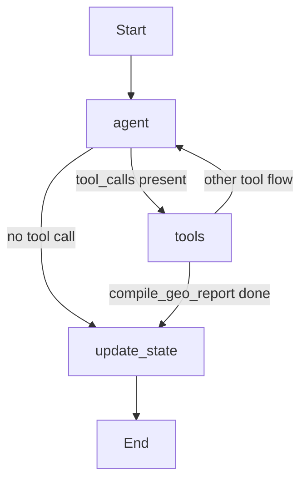
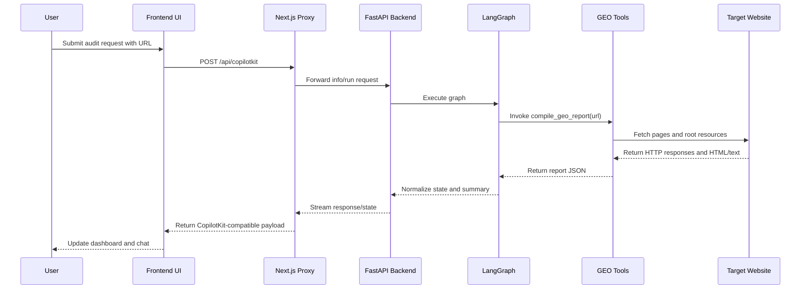

# GEO Audit Agent: Technical Architecture Document

## 1. Purpose of This Document

This document describes the technical architecture of the GEO Audit Agent application. It is intended for developers, maintainers, technical reviewers, and future contributors who need to understand how the system is structured, how responsibilities are separated, how data flows through the application, and where to extend or harden the current implementation.

This document complements the broader functional analysis by focusing specifically on architecture, runtime boundaries, integration contracts, component responsibilities, and operational behavior.

## 2. Architectural Intent

The application is designed as a domain-specific AI-assisted audit system for Generative Engine Optimization. Architecturally, it follows a layered pattern with a strict separation between:

- presentation and user interaction,
- agent orchestration,
- deterministic audit logic,
- export and reporting output.

The system deliberately does not rely on the language model to perform the website audit itself. Instead, the language model acts as a routing and conversational layer, while the actual GEO inspection is implemented in deterministic Python functions. This is one of the most important architectural decisions in the project because it improves predictability, debuggability, and report consistency.

## 3. System Context

At runtime, the system consists of:

- a Next.js frontend application,
- a FastAPI backend application,
- a LangGraph-based agent workflow,
- one configured LLM provider,
- outbound HTTP access to the audited target website.

The browser communicates only with the Next.js application. The Next.js application then proxies CopilotKit and AGUI traffic to the backend. The backend, in turn, interacts with the LLM provider and with the audited site.

## 4. Top-Level Architecture

```mermaid
flowchart LR
    User[User in Browser] --> FE[Next.js Frontend]
    FE --> Proxy[/api/copilotkit proxy]
    Proxy --> BE[FastAPI Backend]
    BE --> Graph[LangGraph Workflow]
    Graph --> LLM[Configured LLM Provider]
    Graph --> Tools[Deterministic GEO Tools]
    Tools --> Target[Target Website]
    FE --> Export[/api/report/export]
```

## 5. Logical Layers

### 5.1 Presentation Layer

The presentation layer lives in the frontend application and includes:

- the chat interface,
- the dashboard,
- visual report panels,
- the methodology modal,
- responsive layout and branding,
- the report export trigger path.

This layer is responsible for rendering state, collecting user prompts, and presenting results. It does not perform direct audit logic.

### 5.2 Interaction and Agent Integration Layer

This layer is shared between frontend and backend.

On the frontend side, it includes:

- `CopilotKit`,
- `CopilotChat`,
- `useCoAgent`,
- `useCopilotReadable`,
- `useCopilotAction`,
- the `/api/copilotkit` proxy route.

On the backend side, it includes:

- the `CopilotKitSDK`,
- the AGUI endpoint,
- the compatibility wrapper that bridges execution expectations.

This layer is what makes the application conversational and state-synchronized.

### 5.3 Orchestration Layer

This layer is implemented via LangGraph. Its job is to:

- interpret the user prompt,
- resolve whether a URL is available,
- invoke the report tool,
- normalize tool results into application state,
- return a stable assistant-facing summary.

This layer is intentionally light on business logic. It orchestrates execution but does not implement the actual audit computations.

### 5.4 Domain Logic Layer

This layer contains the GEO audit functions. It performs:

- website fetching,
- robots.txt analysis,
- `llms.txt` analysis,
- schema inspection,
- metadata inspection,
- technical checks,
- content quality heuristics,
- authority and brand checks,
- citability scoring,
- platform readiness scoring,
- final report assembly.

This is the business core of the application.

### 5.5 Output and Export Layer

This layer transforms the internal report structure into end-user artifacts:

- rich dashboard UI,
- inline generative UI fragments in chat,
- markdown reports,
- PDF reports.

## 6. Deployment Units

### 6.1 Frontend Deployment Unit

The frontend is a Next.js application. It includes both browser-rendered UI and server-side route handlers.

Its major responsibilities are:

- serving the main UI,
- exposing the browser entry point,
- handling static assets and icons,
- proxying agent traffic,
- exporting reports.

### 6.2 Backend Deployment Unit

The backend is a FastAPI application with a mounted CopilotKit SDK surface and a LangGraph AGUI surface.

Its major responsibilities are:

- LLM provider initialization,
- graph execution,
- tool registration,
- state normalization,
- health exposure,
- CORS handling for local frontend access.

### 6.3 External Dependencies

The application depends on three categories of external systems:

- LLM vendor endpoints,
- target websites being audited,
- optional Google Form / external links used in the frontend.

The first two directly affect runtime correctness and latency.

## 7. Frontend Architecture

### 7.1 Main Page Composition

The main page is a composite screen with two primary visual areas:

- the dashboard area,
- the chat area.

The layout is responsive. On large screens, the dashboard and chat are displayed side by side. On smaller screens, they are stacked vertically.

The page also owns:

- locale detection,
- methodology modal visibility state,
- the shared co-agent state hook,
- localized UI labels,
- social and feedback links,
- browser-facing icon and branding context.

### 7.2 Shared State Strategy

The frontend uses `useCoAgent<GeoAuditState>` with the `default` agent identity. This is the core state synchronization mechanism.

The dashboard consumes this state directly. Therefore:

- there is no separate client-side polling layer,
- there is no duplicate fetch path for audit results,
- the backend agent remains the single source of truth for audit execution state.

This is architecturally strong because it avoids result drift between chat and dashboard.

### 7.3 Dashboard Rendering Strategy

The dashboard composes specialized presentational components depending on which fields are available in the shared state.

This is effectively a panel orchestration layer. It allows the report to remain structured and typed, while the UI remains modular.

The dashboard does not need to know how the report was produced. It only needs the shape of the `GeoAuditState` and `GeoReport` payloads.

### 7.4 Chat Rendering Strategy

The chat layer is powered by `CopilotChat`. Inline UI fragments are enabled through frontend Copilot actions, while broader state rendering is handled by the dashboard.

This creates two complementary presentation models:

- action-based renderables inside the chat stream,
- state-based panels in the dashboard.

The architecture is resilient because either surface can remain useful even if the other is partially degraded.

### 7.5 Frontend-Only Analytical Actions

Several actions use the already-computed report state and do not trigger a new crawl:

- recommendation prioritization,
- platform gap explanation,
- schema template retrieval.

This pattern is architecturally efficient. It keeps expensive network inspection in the backend tools, while letting the frontend expose low-cost analytical affordances over existing data.

## 8. Backend Architecture

### 8.1 FastAPI Application Composition

The backend application is intentionally compact. It wires together:

- environment loading,
- the FastAPI app instance,
- CORS middleware,
- the CopilotKit SDK endpoint,
- the AGUI LangGraph endpoint,
- the health endpoint.

The backend does not expose a broad REST surface. It is optimized around agent execution rather than general CRUD APIs.

### 8.2 Compatibility Wrapper

The `FixedLangGraphAGUIAgent` wrapper exists because the CopilotKit SDK expects an `execute()` method while the base AGUI agent shape is not fully aligned with that expectation.

Architecturally, this wrapper acts as an anti-corruption layer between two libraries with slightly different runtime contracts. This is a good containment strategy: compatibility logic is localized rather than leaking across the codebase.

### 8.3 LLM Provider Factory

The provider factory supports multiple backends:

- OpenAI,
- OpenRouter,
- Azure OpenAI / Azure AI Foundry compatible providers,
- Vertex AI.

This is implemented as a centralized runtime selection mechanism driven by environment variables. The architecture therefore supports portability across vendor ecosystems without changing orchestration logic.

However, because providers differ in their reliability and tool-calling behavior, the graph includes normalization and fallback logic. This is an example of an architectural consequence created by portability.

## 9. LangGraph Workflow Architecture

### 9.1 Node Design

The workflow contains three nodes:

- `agent`
- `tools`
- `update_state`

This is intentionally minimal. The graph is not being used for elaborate branching or planning. Instead, it functions as a controlled bridge between conversational input and deterministic report generation.

### 9.2 Execution Flow



### 9.3 Agent Node Responsibilities

The `agent` node performs:

- language detection,
- system prompt construction,
- LLM invocation,
- textual tool-call normalization fallback,
- high-level error fallback messaging.

It does not calculate GEO metrics. It only decides or normalizes the route toward deterministic logic.

### 9.4 Tool Node Responsibilities

The `tools` node is the execution boundary for registered audit tools. In the current implementation, the dominant path is a single invocation of `compile_geo_report(url)`.

### 9.5 Update-State Node Responsibilities

The `update_state` node transforms the raw report JSON into the shared `GeoAuditState` structure expected by the frontend.

This node is essential because it provides a stable integration boundary between backend audit logic and frontend visualization. It also generates the final assistant summary without a second LLM call.

### 9.6 Architectural Significance of the Current Graph

The graph is intentionally conservative. It behaves more like a stateful router than a free-form autonomous agent. This is appropriate for a product where deterministic report quality matters more than emergent chain behavior.

## 10. Data Flow Architecture

### 10.1 End-to-End Runtime Flow



### 10.2 Data Shapes

The most important data contracts are:

- `GeoAuditState`
- `GeoReport`
- `Recommendation`
- `CrawlerInfo`
- `ScoreBreakdown`

This typed contract is what ties the backend report generator, frontend dashboard, export system, and auxiliary actions together.

Architecturally, the report schema is the backbone of the whole application.

## 11. CopilotKit Proxy Architecture

The Next.js route under `/api/copilotkit/[[...path]]` acts as a protocol adapter.

Its responsibilities are:

- forwarding runtime info requests,
- normalizing backend URLs,
- proxying general CopilotKit traffic,
- mapping `agent/run` single-route envelopes into the AGUI backend contract,
- short-circuiting `agent/connect` to a `204` response.

Without this proxy, the frontend would be tightly coupled to backend routing semantics. By keeping protocol adaptation in one route handler, the browser-facing application remains cleaner and more stable.

## 12. Report Export Architecture

The export route accepts a `GeoReport` payload and transforms it into either markdown or PDF.

### 12.1 Markdown Path

The markdown path is a deterministic serialization of the report state into a human-readable structured document. It includes both summary sections and a raw JSON appendix.

### 12.2 PDF Path

The PDF path is generated from markdown using `pdf-lib`, with primitive line wrapping and page management.

The architectural implication is that export formatting is application-owned. The app does not depend on a third-party reporting backend for deliverables.

## 13. Configuration Architecture

### 13.1 Backend Configuration Domains

Backend configuration governs:

- provider selection,
- provider credentials,
- model selection,
- timeouts,
- retry behavior.

### 13.2 Frontend Configuration Domains

Frontend configuration governs:

- backend target URLs,
- AGUI endpoint target,
- public external links,
- browser-facing link branding.

The frontend intentionally avoids storing LLM keys or sensitive provider credentials. This is an important architectural boundary.

## 14. Cross-Cutting Concerns

### 14.1 Resilience

The application includes resilience in multiple layers:

- fallback assistant messaging on provider failure,
- tool-call reconstruction for malformed provider output,
- message-count guard against runaway loops,
- proxy normalization to avoid redirect/protocol issues.

### 14.2 Observability

Observability is currently lightweight and mostly operational:

- backend health endpoint,
- terminal logs during local development,
- deterministic report payloads that are easy to inspect.

There is no dedicated telemetry stack, no trace store, and no persistent audit history yet.

### 14.3 Security Boundaries

The architecture currently enforces at least the following boundaries:

- provider secrets remain server-side,
- browser traffic goes through the frontend proxy,
- backend CORS is limited to the local frontend origin,
- public links are separated from backend configuration.

This is sufficient for a local or internal prototype, but production hardening would still require stronger auth, rate limiting, and stricter request governance.

### 14.4 Performance

Performance is shaped primarily by:

- network latency to the target website,
- LLM response latency,
- the cost of the combined report tool,
- frontend hydration and panel rendering.

The architectural optimization already present is the direct route from `compile_geo_report` to `update_state`, which eliminates an extra model turn.

## 15. Architectural Decisions and Rationale

### 15.1 Single Aggregated Report Tool

Decision: use a single dominant `compile_geo_report` tool instead of many step-by-step model-driven tool calls.

Rationale:

- lower variance,
- easier debugging,
- simpler frontend state mapping,
- faster stabilization of the user experience.

### 15.2 Shared State Between Chat and Dashboard

Decision: dashboard and chat share one state model.

Rationale:

- avoids duplicated fetch logic,
- prevents inconsistent render states,
- keeps the backend as the source of truth.

### 15.3 Frontend Proxy for CopilotKit and AGUI

Decision: hide backend protocol details behind a Next.js route.

Rationale:

- isolates protocol mismatches,
- reduces browser complexity,
- improves portability of the frontend.

### 15.4 Deterministic Post-Tool Summary

Decision: generate the final assistant summary from the report payload, not from a second LLM step.

Rationale:

- lower latency,
- fewer provider failures,
- more reliable dashboard completion.

## 16. Known Architectural Constraints

The current architecture has some intentional limits.

### 16.1 No Persistence Layer

There is no database or long-term report storage. The architecture is session-oriented.

### 16.2 No Full-Site Crawl Engine

The current system is URL-centric, with limited root-level auxiliary resource inspection.

### 16.3 Limited Operational Telemetry

There is no full tracing, metrics pipeline, or structured observability layer.

### 16.4 Local-Origin CORS Assumption

The current backend CORS policy is aligned with the local development frontend and would need revision in production deployments.

## 17. Evolution Paths

This architecture can evolve in several directions without large conceptual rewrites.

### 17.1 Persistence and Historical Analysis

Add a data store for:

- audit history,
- multi-run comparison,
- regression tracking,
- organization-level workspaces.

### 17.2 Broader Crawl Scope

Extend the deterministic audit layer to cover:

- multi-page crawling,
- sitemap traversal,
- template-level site analysis,
- scheduled re-audits.

### 17.3 Improved Export and Deliverables

Extend the export layer with:

- branded PDF formatting,
- slide-friendly executive reports,
- CSV or JSON download variants,
- report versioning.

### 17.4 Production Hardening

Add:

- authentication,
- per-user sessions,
- rate limiting,
- structured logs,
- telemetry and tracing,
- error classification and reporting.

## 18. Recommended Mental Model for Engineers

The cleanest technical model of the application is this:

- the frontend is a synchronized rendering shell,
- the backend graph is an orchestration bridge,
- the tool layer is the actual GEO engine,
- the report schema is the central contract.

If maintainers keep this mental model, the codebase remains understandable even as features grow.

## 19. Final Assessment

The current architecture is sound for an experimental but serious application. It is not a toy chat wrapper. It contains deliberate choices about determinism, state synchronization, portability across model providers, and audit report consistency.

Its strongest architectural properties are:

- strong separation between orchestration and deterministic domain logic,
- a typed report contract shared across layers,
- a clean proxy boundary between browser and backend protocols,
- resilience against unreliable provider tool-call behavior,
- a dual-surface UI that supports both conversation and structured inspection.

The most important future investments should target persistence, observability, and production-grade operational hardening. The current architecture is a strong base for those next steps.